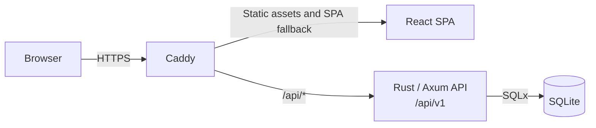

# aAIdle

[](https://reports.aaidle.com/frontend-coverage/)
[](https://reports.aaidle.com/backend-coverage/)

aAIdle is a daily guessing game for AI models.
It runs on a VPS with a React frontend, a Rust/Axum API, and SQLite.
The daily answer stays server-side.

## Documentation

- [Architecture](docs/architecture.md) describes system boundaries and data flow.
- [Backend operations](docs/backend/operations.md) covers the Rust service, configuration, SQLite, and Docker.
- [API v1 contract](docs/backend/api-v1.md) defines the public Rust API.

## System overview



Caddy serves the Vite-built frontend and proxies API requests to the private Rust container. The API owns server-authoritative game and account state, including the secret daily answer.

## Local development

```bash
pnpm install
cp backend/.env.example backend/.env
make up
pnpm dev
```

When `RESEND_API_KEY` is not configured locally, account activation links are shown in the browser instead of being sent by email.

Run all required checks with:

```bash
pnpm check
pnpm test:e2e
```

## Unit tests

Frontend unit tests are in `tests/specs/unit/` and run with `pnpm test:unit`; use `pnpm test:unit:coverage` to generate the frontend coverage report. Rust unit tests live in adjacent `tests.rs` modules under `backend/src/`, while integration and executable workflow tests live in `backend/tests/`; run all backend tests with `cd backend && cargo test`.

The full migration, seed, and fixture executable workflow remains disabled because it does not terminate reliably. Backend coverage excludes executable entry points under `backend/src/bin/`.

Any API behavior change must update `docs/backend/api-v1.md` and the affected frontend, handler, domain, repository, and integration tests. New routes, response fields, validation rules, and error branches require corresponding tests. Release CI publishes separate frontend and backend coverage reports, and backend coverage enforces a 95% minimum for lines, functions, regions, and branches.

## Delivery

Pull requests to `main` run `pnpm check`.
Formatting-only lint failures are fixed and committed by `github-actions[bot]` to the PR branch.
Automation never commits to `main`.

After merge, the release workflow creates a SemVer tag, verifies the application and Docker image, and publishes the tagged image to GitHub Container Registry.
After `production` approval, the VPS pulls that image and keeps only the runtime Compose file, environment file, and persistent SQLite volume.
Make the linked GitHub Container Registry package public so the VPS can pull it without a registry credential.
The release tag is exposed as `html[version]` in the deployed page.
Production browser tests run in Chromium, Firefox, and mobile projects and publish a merged Allure report to GitHub Pages alongside unit coverage.

Configure the `production` GitHub Environment with a required reviewer.
Set GitHub Pages to deploy from GitHub Actions.

Repository secrets:

- `AAIDLE_VPS_HOST`
- `AAIDLE_VPS_USER`
- `AAIDLE_VPS_SSH_KEY`
- `AAIDLE_DEPLOY_PATH`
- `AAIDLE_DAILY_SELECTION_SECRET`

## Accounts

Accounts support GitHub and Google OAuth, plus email/password sign-in with email activation and password reset.
The production environment also needs these secrets before account sign-in is enabled:

- `AAIDLE_AUTH_SECRET`
- `AAIDLE_GITHUB_CLIENT_ID`
- `AAIDLE_GITHUB_CLIENT_SECRET`
- `AAIDLE_GITHUB_ISSUES_TOKEN` with Issues write access for `Wichtowski/aaidle`
- `AAIDLE_GOOGLE_CLIENT_ID`
- `AAIDLE_GOOGLE_CLIENT_SECRET`
- `AAIDLE_RESEND_API_KEY`

## Admin access

User permissions are stored in SQLite as `user`, `developer`, or `superadmin`.
`developer` and `superadmin` accounts can inspect registered users, synced progress, and challenge completions at `/admin`.
Passwords, sessions, and authentication tokens are never exposed in the dashboard.

Configure GitHub and Google OAuth callbacks as `https://aaidle.com/api/v1/auth/oauth/<provider>/callback`.

## Static frontend

The frontend is a Vite-built React SPA. CI deploys the `dist/` assets to the VPS, where the
platform Caddy instance serves the SPA fallback and proxies `/api/*` to the private Rust API
container. The frontend does not run in a production container.
Signed-in users can submit issue reports through the Rust API. Configure `AAIDLE_GITHUB_ISSUES_TOKEN` with GitHub Issues write access for `Wichtowski/aaidle` to enable delivery.
Verify `aaidle.com` in Resend and create `AAIDLE_RESEND_API_KEY` before enabling email/password accounts.

## Model catalog

The canonical model and Emoji-game seed data live in [data](data). After updating either file, run:

```bash
pnpm db:validate-seed
```

The Classic catalog is edited in six category-focused files and merged into the single seed file used by the application:

```bash
# edit data/classic/classic.<category>.seed.json files
pnpm classic-merge-to-one
```

The category files are the source of truth for Classic models; the merge command writes the canonical `data/classic.seed.json` file.

Timeline events are maintained separately in `data/timeline/events.seed.json`. Run `pnpm timeline-merge-to-one` after `pnpm classic-merge-to-one` to combine those events with the merged Classic catalog and regenerate `data/timeline.seed.json`.
